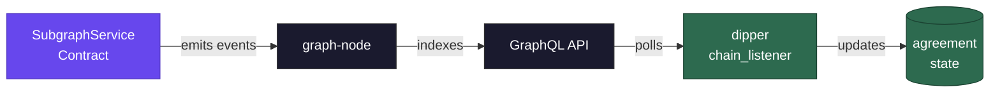

<h1 align="center">
  <br>
  Indexing Payments Subgraph
  <br>
</h1>

<h4 align="center">On-chain event indexer for the indexing agreement lifecycle in <a href="https://thegraph.com">The Graph</a> protocol.</h4>

<p align="center">
  <a href="https://github.com/graphprotocol/indexing-payments-subgraph/actions"></a>
  <a href="LICENSE"></a>
  <a href="https://thegraph.com"></a>
  <a href="https://thegraph.com/docs"></a>
</p>

<br>

## What It Does

This subgraph tracks the full lifecycle of [Direct Indexing Payments](https://github.com/graphprotocol/contracts/tree/main/packages/subgraph-service) (DIPs) agreements on-chain. It indexes events emitted by the `SubgraphService` contract through the `IndexingAgreement` library and exposes them via a GraphQL API that downstream services can query.

[Dipper](https://github.com/edgeandnode/dipper) is the primary consumer -- its chain listener polls this subgraph to detect when indexers accept or cancel agreements, keeping its internal state in sync with on-chain reality without direct RPC polling.

<br>

## Events

<table>
<tr><td width="300"><code>IndexingAgreementAccepted</code></td><td>Indexer accepts an RCA on-chain, creating an allocation</td></tr>
<tr><td><code>IndexingAgreementCanceled</code></td><td>Agreement canceled by payer or indexer</td></tr>
<tr><td><code>IndexingAgreementUpdated</code></td><td>Agreement terms or allocation changed</td></tr>
<tr><td><code>IndexingFeesCollectedV1</code></td><td>Fees collected against an active agreement</td></tr>
</table>

<br>

## Architecture



<br>

## Quick Start

```bash
npm install
npm run prepare:hardhat     # generate manifest from template
npx graph codegen           # generate AssemblyScript types
npx graph build             # compile to WASM
npm test                    # matchstick unit tests (Linux only)
```

<br>

## Deployment

Each network has a config file in `config/` with the contract address and start block.

```bash
# 1. Generate manifest for target network
npm run prepare:hardhat

# 2. Create and deploy
npx graph create --node http://localhost:8020 indexing-payments
npx graph deploy --node http://localhost:8020 --ipfs http://localhost:5001 \
  --version-label v0.1.0 indexing-payments
```

<details>
<summary><strong>Available networks</strong></summary>
<br>

| Network | Config | SubgraphService Address |
|:--------|:-------|:------------------------|
| Hardhat (local) | [`config/hardhat.json`](config/hardhat.json) | `0xCf7Ed3AccA5a467e9e704C703E8D87F634fB0Fc9` |
| Arbitrum One | [`config/arbitrum-one.json`](config/arbitrum-one.json) | TBD |
| Arbitrum Sepolia | [`config/arbitrum-sepolia.json`](config/arbitrum-sepolia.json) | TBD |

</details>

<br>

## License

[MIT](LICENSE)
